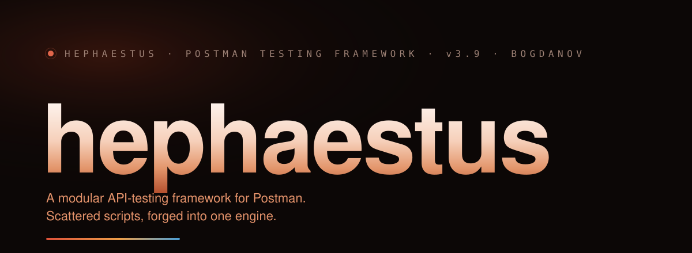

<p align="center">
  
</p>

<p align="center">
  
  
  
  
  
  
</p>

<p align="center">
  <b>English</b> · <a href="README.ru.md">Русский</a>
</p>

<p align="center"><i>Scattered scripts, forged into one engine.</i></p>

---

Hephaestus is a modular API-testing framework for Postman and Newman. Instead
of a pile of copy-pasted pre/post-request scripts, every request carries a
small `override` config and delegates all logic to one version-controlled
engine: config merge, auth, assertions, snapshot regression, schema
validation, a security audit and structured logging, run in a fixed pipeline.

Same author and house style as [Keel](https://github.com/bogdanov-igor/keel)
and [Loft](https://github.com/bogdanov-igor/loft), my Claude Code kernels.
This is a different domain — it shares only the discipline: measure what you
ship, be honest about what it does not do, and carry zero services you do not
need.

## New — English and Russian output

Every user-facing string the engine emits — test names, log lines, assertion
messages, status labels, the security audit — now routes through a locale
catalog ([`engine/src/shared/i18n.js`](engine/src/shared/i18n.js)). Pick the
language in config:

```json
{ "locale": "en" }
```

The default is `"ru"` and is **byte-identical** to every previous release, so
existing collections and their golden baselines do not shift. `"en"` gives the
same engine in English. The golden harness pins both.

## Quickstart

Two runtimes ship in one repo: the **engine** that runs inside Postman, and a
**zero-dependency Node CLI** for Newman and CI. Start with the engine.

**1.** Import the shipped collection — the engine is embedded at build time, so
a fresh import runs offline, no fetch step:

```text
Postman → Import → collection/hephaestus-template.postman_collection.json
```

**2.** Open **⚙️ defaults** in the `Hephaestus System` folder, edit the JSON
body, and Send:

```json
{
  "baseUrl": "https://your-api.example.com",
  "locale": "en",
  "auth": { "enabled": false, "type": "none" },
  "contentType": "json",
  "snapshot": { "enabled": false, "autoSaveMissing": true, "mode": "non-strict" },
  "secrets": ["token", "password", "pass", "secret", "key", "authorization", "session"],
  "ci": false
}
```

**3.** Give any request an `override` and hand off to the engine. Pre-request:

```javascript
const override = {
  auth: { enabled: true, type: "bearer", token: "{{prod.token}}" }
};
eval(pm.collectionVariables.get("hephaestus.v3.pre"));
```

Tests (post-request):

```javascript
const override = {
  contentType: "json",
  keysToFind: [
    { path: "data.id",     name: "ID" },
    { path: "data.status", name: "Status", expect: "active" }
  ],
  varsToSave: { token: { path: "data.token", name: "prod.token", scope: "collection" } },
  snapshot: { enabled: true, autoSaveMissing: true }
};
eval(pm.collectionVariables.get("hephaestus.v3.post"));
```

**4.** For CI, run Newman and pipe the results through the CLI (from a clone of
this repo):

```sh
newman run collection.json -e env.json --reporter-json-export results.json -r json
node bin/hephaestus.js summary results.json --sla=500   # p95 gate, exits 1 over budget
```

### Updating the engine

The embedded engine already runs. To pull a newer build from Git in place,
send the `engine-update` request in the `Hephaestus System` folder. It fetches
`engine/pre-request.js` and `engine/post-request.js`, verifies both against
[`engine/checksums.json`](engine/checksums.json) (SHA-256, inside the sandbox)
before installing, and saves them to `hephaestus.v3.pre` / `hephaestus.v3.post`.

## What's inside

- **The engine.** ES modules in `engine/src/**`, bundled by esbuild into two
  files (~172 KB total) and eval'd inside the Postman sandbox — engine-as-data,
  no plugin install, no external runtime. One pre-request pipeline and one
  post-request pipeline drive a chain of modules through a shared `ctx`.
- **Zero-download collection.** The shipped collection embeds the current
  engine at build time. A fresh import runs offline; `engine-update` is only
  for pulling newer code later.
- **Snapshot regression.** Baselines live in `hephaestus.snapshots`, keyed by
  `collection::request::status::format`. `strict` diffs the whole body,
  `non-strict` checks only `checkPaths`. `snapshotRecord` force-rewrites a
  stale baseline in one run when the API legitimately changed.
- **Schema validation.** JSON Schema via a bundled `tv4` — no dependency.
- **Security audit.** Opt-in passive checks on the response: missing protective
  headers, server-version disclosure, stack-trace / debug leaks in the body,
  insecure CORS. Each emits its own test, so a policy breach fails the run.
- **SLA percentiles.** The CLI summary reports p50/p90/p95/p99 response times
  and gates a run on `--sla=<ms>`.
- **OpenAPI / Swagger import.** Turn an OpenAPI 3.x or Swagger 2.0 spec (JSON,
  or a common subset of YAML) into a ready collection — `expectedStatus` and
  `schema` pre-filled per operation — with zero dependencies.
- **Snapshots → Postman Examples.** Sync saved snapshots into native Example
  Responses, usable with the Mock Server.
- **Secret masking.** Keys named in `secrets`, and matching URL query params,
  are masked in log output only — saved values are never altered.

## What it leaves out

- **No test runner of its own.** Hephaestus is the logic; Postman and Newman
  run it. There is no daemon, no hosted service, no dashboard, no database.
- **State lives in the collection.** Snapshots, OAuth2 tokens and plugins are
  collection variables. That keeps everything portable and diffable, but it is
  not a datastore — large snapshot sets belong in a real regression pipeline.
- **The integrity check is tamper-evidence, not authenticity.** `engine-update`
  proves the code it fetched matches `checksums.json` in transit. It does not
  prove who authored that checksum — there is no signature. Trust the source
  you pull from. This is stated the same way in [SECURITY.md](SECURITY.md).
- **Schema is JSON Schema draft 4** (the bundled `tv4`), not the newest drafts
  — the price of zero runtime dependencies.
- **OpenAPI import parses JSON and a common YAML subset**, not the full YAML
  spec. Odd specs may need a JSON conversion first.

## Configuration

Everything is one merged config: `hephaestus.defaults` (collection-wide)
deep-merged with a per-request `override`. Common fields:

| Field | Default | Purpose |
|---|---|---|
| `baseUrl` | `""` | API base; protocol prepended from `defaultProtocol` if omitted |
| `locale` | `"ru"` | Engine output language — `"ru"` or `"en"` |
| `auth` | `none` | `none` · `basic` · `bearer` · `headers` · `variables` · `oauth2cc` |
| `contentType` | `"json"` | Response parsing: `json` · `xml` · `text` |
| `expectedStatus` | `[200,201,202]` | Expected HTTP status — a number or list; drives negative testing |
| `maxResponseTime` | `1000` | Fail if the response is slower (ms) |
| `snapshot` | disabled | `mode`, `checkPaths`, `ignorePaths`, `autoSaveMissing`, `record` |
| `schema` | disabled | JSON Schema definition validated via `tv4` |
| `securityAudit` | disabled | Passive header / disclosure / CORS checks |
| `secrets` | `[…]` | Key names masked in logs |
| `ci` | `false` | Emit a structured `[HEPHAESTUS_CI]` JSON line per request |

The full field-by-field reference lives in
[`docs/config-reference.html`](docs/config-reference.html).

## Modules

The engine is a fixed set of modules run through a shared `ctx` — this is an
inventory, not the exact call order:

**Pre-request** — `configMerge` · `envRequired` · `iterationData` · `random` ·
`urlBuilder` · `auth` · `dateUtils` · `logger`.

**Post-request** — `configMerge` · `normalizeResponse` · `metrics` ·
`extractor` · `assertions` · `assertEach` · `assertShape` · `assertOrder` ·
`assertUnique` · `assertHeaders` · `retryOnStatus` · `snapshot` · `schema` ·
`securityAudit` · `plugins` · `logger`.

`assertions` covers `keysToFind` / `varsToSave` / `keysToCount` / `assertMap` /
`maxResponseTime`; `extractor` exposes `ctx.api` with `get / find / all /
count / save` over JSON and XML, dot-paths and `[*]` wildcards. Custom
`plugins` extend the engine from collection variables without forking. Per-module
detail and examples are in [`docs/features.html`](docs/features.html).

## CLI

Zero-dependency Node tooling, one binary, propagates exit codes so every
command works as a CI gate. From a clone of this repo:

```sh
node bin/hephaestus.js <command> [args]
# the same tools are wired as npm scripts:
npm run <command> -- [args]
```

> Not yet published to npm. Once it is, the same commands will run as
> `npx hephaestus <command>` without a clone.

| Command | Does |
|---|---|
| `summary <results.json> [--md] [--sla=<ms>]` | Run summary + p50/p90/p95/p99, SLA gate |
| `compare <before> <after> [--md]` | Diff two runs — regression gate, exit 1 on regression |
| `report <results.json> [out.html]` | Self-contained HTML report |
| `junit <results.json\|-> [out.xml]` | Newman JSON → JUnit XML |
| `migrate <collection.json>` | Classify a collection's migration state |
| `docs <collection.json>` | API docs from a collection's test scripts |
| `sync-examples <collection.json>` | Snapshots → Postman Example Responses |
| `openapi <spec>` | OpenAPI / Swagger → Hephaestus collection |
| `init` | Interactive config / environment wizard |
| `watch -c <collection.json>` | Re-run Newman on file change |

`node bin/hephaestus.js --help` lists everything.

## Tests & integrity

- **Engine golden harness** — the real engine runs under Newman against a mock
  server and its output is compared byte-for-byte to a golden baseline:
  **200 assertions across 17 requests**, both locales pinned. It catches any
  drift in engine behaviour, not just in the tooling.
- **`npm test`** — **46 tests** over the CLI scripts (docs, summary, compare,
  JUnit, migrate, OpenAPI import, sync-examples) and the secret-redaction check.
- **`npm run build`** — **10 checks**: engine bundle in sync with `engine/src`,
  version single-sourced, `checksums.json` and the embedded collection current,
  defaults and collection valid JSON.
- **eslint** clean across `engine/`, `setup/`, `templates/`.

Zero runtime dependencies. Dev-only: `esbuild` (pinned), `newman`, `eslint`.

## Documentation

| Doc | What's in it |
|---|---|
| [quickstart](docs/quickstart.html) | Import → defaults → first request, end to end |
| [config reference](docs/config-reference.html) | Every config field, typed, with defaults |
| [recipes](docs/recipes.md) | 10 common tasks → 10 ready-to-paste `override` blocks |
| [features](docs/features.html) | Module-by-module guide with examples |
| [newman & CI](docs/newman-ci.md) | GitHub Actions, GitLab CI, Jenkins setups |
| [snapshot viewer](docs/snapshot-viewer.html) | Visual browser for `hephaestus.snapshots` |
| [docs home](docs/index.html) | Local documentation site index |

The full guide is bilingual: this file (English) and
[README.ru.md](README.ru.md) (Русский).

## Licence

[MIT](LICENSE) © 2026 **Igor Bogdanov** · <bogdanov.ig.alex@gmail.com>

Free to use, fork and build on, commercially included. Keep the attribution.
