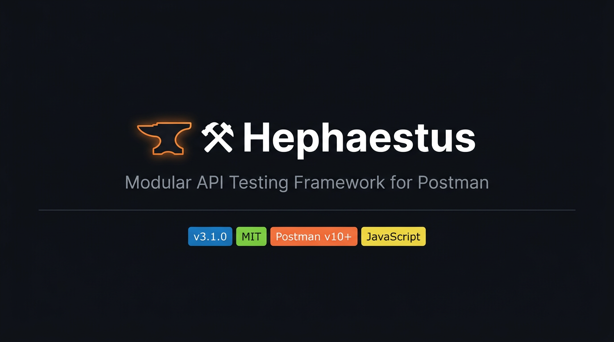

<div align="center">



# ⚒️ Hephaestus

**Модульный фреймворк автоматизации API-тестирования для Postman**

[](CHANGELOG.md)
[](LICENSE)
[](https://postman.com)
[](https://apidog.com)
[](engine/)
[](mailto:bogdanov.ig.alex@gmail.com)
[](https://bogdanov-igor.github.io/hephaestus-postman-framework/)

**[🇬🇧 English version](README.md)** · **[🌐 Live Docs](https://bogdanov-igor.github.io/hephaestus-postman-framework/)**

[Быстрый старт](#-быстрый-старт) · [Конфигурация](#️-конфигурация) · [Модули](#-модули) · [Архитектура](#️-архитектура) · [APIDog](#-совместимость-с-apidog) · [Автор](#-автор)

</div>

---

## Обзор

**Hephaestus** — open-source фреймворк для организации, автоматизации и стандартизации API-тестирования в Postman. Он заменяет разрозненные pre/post-request скрипты единым, версионируемым движком с поддержкой snapshot-регрессии, валидации схем, гибкой авторизации и маскирования секретов.

Каждый запрос в коллекции содержит только минимальный `override`-конфиг. Всю логику берёт на себя движок, загруженный из Git.

**Для кого:**
- QA-инженеры, автоматизирующие тестирование REST / XML API
- Команды, использующие Postman как основной инструмент
- Коллекции с большим количеством методов, которым нужен единый стандарт
- Проекты с требованием snapshot-регрессии без CI-оверхеда

---

## ✨ Возможности

| Возможность | Описание |
|---|---|
| 🔄 **Pipeline-архитектура** | Orchestrator управляет цепочкой модулей через единый объект `ctx` |
| ⚙️ **Defaults + Override** | Конфиг на уровне коллекции + переопределение на уровне метода |
| 📸 **Snapshot-регрессия** | Автоматический baseline, strict/non-strict режимы, diff-preview в логе |
| 🔐 **Auth-плагин** | `none`, `basic`, `bearer`, `headers`, `variables` — настраивается per-request |
| 🔍 **Extract API** | `ctx.api.get()`, `.find()`, `.all()`, `.count()`, `.save()` — JSON и XML |
| ✅ **Assertions** | `keysToFind` (soft-режим), `varsToSave`, `keysToCount`, `maxResponseTime` |
| 📨 **Header assertions** | `assertHeaders` — проверка наличия, значения, точного совпадения и отсутствия заголовков |
| 🔢 **expectedStatus** | Ожидаемые HTTP-статусы — поддержка негативного тестирования (`400`, `[404, 422]`) |
| 🔌 **Plugin system** | Расширяй движок без форка — загружай кастомные модули из `collectionVariables` в рантайме |
| 📅 **Гибкие даты** | `today±Nd/w/m/y`, `startOfMonth`, `endOfYear`, кастомные переменные через `dates` |
| 📋 **Schema-валидация** | JSON Schema через встроенный `tv4` без зависимостей |
| 🛡️ **Маскирование секретов** | Токены, пароли и query-параметры URL маскируются в логах автоматически |
| 📊 **Красивые логи** | Эмодзи, ASCII-рамки, preview ответа, diff снапшота, CI-режим |
| 🔄 **Auto-update** | Движок обновляется из Git одним запросом — `engine-update` |

---

## 🏛️ Архитектура

```
┌──────────────────────────────────────────────────────────────────┐
│                         PRE-REQUEST                              │
│                                                                  │
│   configMerge → urlBuilder → auth → dateUtils → logger           │
│                                                                  │
│   • Объединяет hephaestus.defaults + override                    │
│   • Выставляет pm.variables.baseUrl (автоподстановка протокола)  │
│   • Подставляет auth (headers / pm.variables)                    │
│   • Логирует конфиг с маскированием секретов                     │
└──────────────────────────────────────────────────────────────────┘
                        ⬇  HTTP-запрос  ⬇
┌──────────────────────────────────────────────────────────────────┐
│                         POST-REQUEST                             │
│                                                                  │
│   configMerge → normalizeResponse → metrics → extractor          │
│   → assertions → assertHeaders → snapshot → schema               │
│   → plugins → logger                                             │
│                                                                  │
│   • Парсит JSON / XML / text ответ в единый ctx.response         │
│   • Проверяет ожидаемый HTTP-статус (expectedStatus)             │
│   • Предоставляет ctx.api для работы с данными                   │
│   • Проверяет assertions, сохраняет переменные                   │
│   • Валидирует заголовки ответа (assertHeaders)                  │
│   • Сравнивает со snapshot или сохраняет baseline                │
│   • Валидирует JSON Schema                                       │
│   • Запускает плагины из collectionVariables                     │
│   • Выводит структурированный лог с маскированием               │
└──────────────────────────────────────────────────────────────────┘
```

### Как работает движок

```
Git (engine/pre-request.js + engine/post-request.js)
         ↓  engine-update (pm.sendRequest)
collectionVariables["hephaestus.v3.pre"]
collectionVariables["hephaestus.v3.post"]
         ↓  каждый метод
eval(pm.collectionVariables.get("hephaestus.v3.pre"))
eval(pm.collectionVariables.get("hephaestus.v3.post"))
```

### Объект `ctx`

```javascript
ctx = {
    config:   { /* merged: defaults + override */ },
    request:  { name, method, url },
    response: { parsed, raw, code, time, size, format },
    api:      { get(path), find(path, fn), count(path), save(path, target) }
}
```

---

## 🚀 Быстрый старт

### Шаг 1 — Импортировать коллекцию

```
Postman → Import → collection/hephaestus-template.postman_collection.json
```

### Шаг 2 — Привязать environment

Создать или подключить environment с переменными:

```
login.*      — логины пользователей
password.*   — пароли
channel.*    — дополнительные поля (если нужно)
```

### Шаг 3 — Настроить defaults

Открыть **⚙️ defaults** в `🛠️ Hephaestus System`, отредактировать JSON в Body и нажать **Send**:

```json
{
  "baseUrl": "https://your-api.example.com",
  "defaultProtocol": "https",
  "auth": { "enabled": false, "type": "none" },
  "contentType": "json",
  "snapshot": { "enabled": false, "autoSaveMissing": true, "mode": "non-strict" },
  "secrets": ["token", "password", "pass", "key"],
  "ci": false
}
```

### Шаг 4 — Загрузить движок

```
🛠️ Hephaestus System → 🔧 engine-update → Send
```

Движок загрузится из Git в `hephaestus.v3.pre` и `hephaestus.v3.post`.  
Повторять при обновлении фреймворка.

### Шаг 5 — Написать метод

Каждый метод содержит только `override` + вызов движка:

**Pre-request script:**
```javascript
const override = {
    auth: {
        enabled: true,
        type: "bearer",
        token: "{{prod.token}}"
    }
};

eval(pm.collectionVariables.get("hephaestus.v3.pre"));
```

**Tests (Post-request):**
```javascript
const override = {
    contentType: "json",
    keysToFind: [
        { path: "data.id",     name: "ID" },
        { path: "data.status", name: "Статус", expect: "active" }
    ],
    varsToSave: {
        token: { path: "data.token", name: "prod.token", scope: "collection" }
    },
    snapshot: { enabled: true, autoSaveMissing: true }
};

eval(pm.collectionVariables.get("hephaestus.v3.post"));
```

---

## ⚙️ Конфигурация

### Полный список полей

| Поле | Тип | По умолчанию | Описание |
|---|---|---|---|
| `baseUrl` | string | `""` | Базовый URL API — протокол можно не указывать, подставится автоматически |
| `defaultProtocol` | string | `"https"` | Протокол по умолчанию, если в `baseUrl` не указан. `"http"` — выдаст предупреждение |
| `auth.enabled` | boolean | `false` | Включить авторизацию |
| `auth.type` | string | `"none"` | Тип: `none`, `basic`, `bearer`, `headers`, `variables` |
| `contentType` | string | `"json"` | Ожидаемый формат ответа: `json`, `xml`, `text` |
| `expectEmpty` | boolean | `false` | Ожидать пустой ответ |
| `expectedStatus` | number \| number[] | `[200,201,202]` | Ожидаемые HTTP-статусы. Для негативного тестирования: `400`, `[404, 422]` |
| `maxResponseTime` | number | `1000` | Макс. время ответа в мс. Тест падает при превышении |
| `dateFormat` | string | `"yyyy-MM-dd"` | Формат дат для всех date-переменных |
| `dates` | object | — | Кастомные date-переменные — см. [dateUtils](#-dateutils) |
| `assertHeaders` | object[] | `[]` | Проверки заголовков ответа — см. [assertHeaders](#-assertheaders) |
| `snapshot.enabled` | boolean | `false` | Включить snapshot-сравнение |
| `snapshot.mode` | string | `"non-strict"` | `strict` (полный diff) или `non-strict` (только checkPaths) |
| `snapshot.autoSaveMissing` | boolean | `true` | Автосохранение baseline при отсутствии |
| `snapshot.checkPaths` | string[] | `[]` | Сравнивать только эти пути (пусто = всё) |
| `snapshot.ignorePaths` | string[] | `[]` | Игнорировать эти пути |
| `schema.enabled` | boolean | `false` | Включить JSON Schema валидацию |
| `schema.definition` | object | `null` | JSON Schema объект |
| `secrets` | string[] | `[...]` | Ключи, значения которых маскируются в логах |
| `ci` | boolean | `false` | CI-режим: структурированный JSON-лог |

### Auth-типы

| Тип | Что делает |
|---|---|
| `none` | Без авторизации |
| `basic` | `Authorization: Basic base64(user:pass)` |
| `bearer` | `Authorization: Bearer {token}` |
| `headers` | Подставляет произвольные заголовки в запрос |
| `variables` | Устанавливает `pm.variables` для подстановок в URL / Body |

**Пример — `variables` (логин + канал + пароль):**
```javascript
auth: {
    enabled: true,
    type: "variables",
    fields: {
        "login":    "{{login.main}}",
        "channel":  "{{channel.main}}",
        "password": "{{password.main}}"
    }
}
```

### Маскирование секретов

Маскирование применяется **только к логам** — сохранённые значения не изменяются.

- Ключи, совпадающие со словами из списка `secrets`, маскируются: `AAAI3A***MASKED***KMR3ms`
- Query-параметры URL с совпадающими именами маскируются в POST-REQUEST логе
- Список настраивается через `secrets` в defaults или override

---

## 🧩 Модули

### Pre-request pipeline

| Модуль | Описание |
|---|---|
| `configMerge` | Deep merge: `hephaestus.defaults` + `override` → `ctx.config` |
| `urlBuilder` | Устанавливает `pm.variables.baseUrl`; автоподставляет `defaultProtocol` |
| `auth` | Auth-плагин — применяет выбранный тип к запросу |
| `dateUtils` | Вычисляет даты (today, tomorrow и др.) в `pm.variables` |
| `logger` | Логирует конфиг запроса с маскированием секретов |

### Post-request pipeline

| Модуль | Описание |
|---|---|
| `configMerge` | Повторный merge для доступа к конфигу в тестах |
| `normalizeResponse` | Парсит JSON / XML (xml2js) / text → `ctx.response` |
| `metrics` | Фиксирует время ответа и размер тела |
| `extractor` | Инициализирует `ctx.api` — Extract API с `get/find/all/count/save` |
| `assertions` | `keysToFind` (soft), `varsToSave`, `keysToCount`, `maxResponseTime` |
| `assertHeaders` | Проверяет заголовки ответа: наличие, значение, точное совпадение, отсутствие |
| `snapshot` | Сравнивает с baseline или сохраняет при `autoSaveMissing`; diff в логе |
| `schema` | Валидирует тело ответа по JSON Schema через `tv4` |
| `plugins` | Запускает кастомные модули из `collectionVariables` (`hephaestus.plugins`) |
| `logger` | Структурированный лог: статус, метрики, assertions, diff снапшота, preview |

### Extract API

```javascript
ctx.api.get("data.user.id")                 // → значение по dot-path (любая глубина)
ctx.api.find("data.items", i => i.active)   // → массив, отфильтрованный по предикату
ctx.api.all("data.items", i => i.active)    // → то же самое (явный синоним find)
ctx.api.count("data.items")                 // → количество элементов
ctx.api.save("data.token", {                // → сохранить в pm scope
    name: "prod.token",
    scope: "collection"                     // "collection" | "environment" | "local"
})
```

Поддерживается wildcard-обход:

```javascript
ctx.api.get("data.items[*].id")  // → массив всех значений id в списке
ctx.api.all("data.items[*]")     // → все элементы списка
```

---

## ✅ Assertions

### keysToFind — поиск и валидация полей

```javascript
keysToFind: [
    { path: "data.id",     name: "ID" },                        // поле существует
    { path: "data.status", name: "Статус", expect: "active" },  // точное совпадение
    { path: "data.count",  name: "Кол-во", expect: v => v > 0 }, // предикат
    { path: "data.extra",  name: "Extra",  soft: true },        // ⚪ soft: не падает если нет
]
```

`soft: true` — тест проходит, даже если поле отсутствует. Используется для опциональных полей.

### varsToSave — сохранение значений в переменные

```javascript
varsToSave: {
    token: { path: "data.token", name: "prod.token", scope: "collection" }
    // scope: "collection" | "environment" | "local"
}
```

### maxResponseTime — проверка времени ответа

Значение по умолчанию — `1000` мс (задаётся глобально в `hephaestus.defaults`). Переопределяется на уровне конкретного метода:

```javascript
// В hephaestus.defaults (глобально для всей коллекции):
{
    "maxResponseTime": 1000   // ⏱ порог для всех методов
}

// В конкретном методе (override):
const override = {
    maxResponseTime: 500   // ⏱ более жёсткий порог для данного метода
};
```

### keysToCount — подсчёт элементов массива

```javascript
keysToCount: {
    items: { path: "data.items", expected: 10 }
}
```

### expectedStatus — ожидаемый HTTP-статус

По умолчанию: `[200, 201, 202]`. Переопределяется для любого сценария:

```javascript
// Один статус (напр. 204 No Content):
const override = { expectedStatus: 204 };

// Несколько статусов:
const override = { expectedStatus: [200, 201] };

// Негативное тестирование — ожидаем 400 Bad Request:
const override = { expectedStatus: 400 };

// Несколько ошибочных кодов:
const override = { expectedStatus: [400, 422] };
```

---

## 📨 assertHeaders

Проверка заголовков ответа прямо в `override`:

```javascript
assertHeaders: [
    // Заголовок существует:
    { name: "X-Request-Id" },

    // Заголовок содержит строку:
    { name: "Content-Type", expect: "application/json" },

    // Точное совпадение:
    { name: "X-Api-Version", equals: "v2" },

    // Условие через функцию:
    { name: "X-Rate-Limit-Remaining", label: "Rate limit > 0", expect: v => Number(v) > 0 },

    // Заголовок должен отсутствовать:
    { name: "X-Deprecated", absent: true },
]
```

| Поле | Тип | Описание |
|---|---|---|
| `name` | string | Имя заголовка |
| `label` | string | Отображаемое имя в Test Results (необязательно) |
| `expect` | string \| function | Проверка contains (строка) или произвольное условие (функция) |
| `equals` | string | Точное совпадение значения |
| `absent` | boolean | Заголовок должен **отсутствовать** в ответе |

---

## 📅 dateUtils

Всегда доступны как `pm.variables`:

| Переменная | Значение |
|---|---|
| `{{currentDate}}` | Сегодня |
| `{{monthsAgo1}}` | 1 месяц назад |
| `{{monthsAgo3}}` | 3 месяца назад |
| `{{monthsAgo6}}` | 6 месяцев назад |
| `{{monthsAgo12}}` | 12 месяцев назад |

**Кастомные переменные** через `dates` в override или defaults:

```javascript
const override = {
    dates: {
        "startDate":  "today-7d",          // 7 дней назад
        "endDate":    "today",             // сегодня
        "nextMonth":  "today+1m",          // +1 месяц
        "weekLater":  "today+1w",          // +7 дней
        "firstDay":   "startOfMonth",      // первый день текущего месяца
        "lastDay":    "endOfMonth",        // последний день текущего месяца
        "yearStart":  "startOfYear",       // 1 января
        "yearEnd":    "endOfYear",         // 31 декабря
        "prevStart":  "startOfPrevMonth",
        "nextStart":  "startOfNextMonth",
    }
};
```

Используй как `{{startDate}}`, `{{endDate}}` и т.д. в URL, body, заголовках.  
Формат задаётся через `dateFormat` (по умолчанию: `yyyy-MM-dd`).

**Поддерживаемые выражения:**

| Выражение | Описание |
|---|---|
| `today` | Текущая дата |
| `yesterday` / `tomorrow` | ±1 день |
| `today+Nd` / `today-Nd` | ±N дней |
| `today+Nw` / `today-Nw` | ±N недель |
| `today+Nm` / `today-Nm` | ±N месяцев |
| `today+Ny` / `today-Ny` | ±N лет |
| `startOfMonth` / `endOfMonth` | Первый/последний день текущего месяца |
| `startOfNextMonth` / `endOfNextMonth` | Первый/последний день следующего месяца |
| `startOfPrevMonth` / `endOfPrevMonth` | Первый/последний день предыдущего месяца |
| `startOfYear` / `endOfYear` | 1 января / 31 декабря |

---

## 📸 Snapshot-регрессия

Snapshot хранится в `hephaestus.snapshots` (collectionVariables) как JSON-объект.

**Ключ snapshot:** `{collectionName}::{requestName}::{statusCode}::{format}`

| Режим | Поведение |
|---|---|
| `non-strict` | Проверяет только `checkPaths`, игнорирует `ignorePaths` |
| `strict` | Полное сравнение структуры (с учётом `ignorePaths`) |

**Управление снапшотами:**

| Действие | Расположение |
|---|---|
| Просмотр | `🛠️ Hephaestus System → 📋 snapshot-view` |
| Очистка | `🛠️ Hephaestus System → 🗑️ snapshot-clear` |
| Фильтр | Переменная `hephaestus.snapshot.clearFilter` |

---

## 🔄 Обновление движка

Версия движка задаётся в `hephaestus.version` (collectionVariables):

| Значение | Результат |
|---|---|
| `main` | Загружает последний коммит из ветки `main` |
| `3.1.0` | Загружает тег `v3.1.0` |

После изменения версии → запустить `🔧 engine-update`.

**Приватные репозитории:** задайте `hephaestus.githubToken` (GitHub PAT).  
Движок переключится на GitHub Contents API вместо raw-ссылок.

---

## 🔌 Совместимость с Apidog

Hephaestus v3 **полностью совместим** с [Apidog](https://apidog.com).

| Функция | Postman | Apidog |
|---|---|---|
| `pm.collectionVariables.get/set` | ✅ | ✅ (Module Variables) |
| `pm.sendRequest` | ✅ | ✅ |
| `eval()` | ✅ | ✅ |
| `pm.test` | ✅ | ✅ |
| `pm.response.json/text` | ✅ | ✅ |
| `pm.variables.set/get` | ✅ | ✅ |

> В Apidog `collectionVariables` называются **Module Variables** в UI, но в коде работают идентично через `pm.collectionVariables.*`.

**Для импорта в Apidog:** `Import → Postman Collection → выбрать JSON файл`.  
Скрипты переносятся без изменений.

---

## 📁 Структура репозитория

```
/
├── README.md                     — документация (English)
├── README.ru.md                  — документация (Русский)
├── CHANGELOG.md                  — история изменений
├── LICENSE                       — лицензия MIT
├── docs/
│   └── banner.png                — баннер проекта
├── .github/
│   ├── ISSUE_TEMPLATE/           — шаблоны issues (баг / фича)
│   └── workflows/lint.yml        — синтаксическая проверка движка при пуше
├── engine/
│   ├── pre-request.js            — движок pre-request  → hephaestus.v3.pre
│   └── post-request.js           — движок post-request → hephaestus.v3.post
├── templates/
│   ├── method.pre-request.js     — шаблон метода (pre)
│   └── method.post-request.js    — шаблон метода (post)
├── setup/
│   ├── defaults.json             — шаблон hephaestus.defaults
│   ├── engine-update.js          — загрузка движка из Git
│   ├── snapshot-clear.js         — очистка снапшотов
│   └── snapshot-view.js          — просмотр снапшотов
└── collection/
    ├── README.md                 — инструкция по импорту
    └── hephaestus-template.postman_collection.json
```

---

## 🎲 ctx.random — Генераторы данных (v3.8)

```javascript
// В override или defaults:
randomData: {
    email:  "random.email",       // → {{email}}
    userId: "random.int:1:9999",  // → {{userId}}
    token:  "random.uuid",        // → {{token}}
}
// Также: ctx.random.uuid/email/str(n)/int/float/bool/pick/date
```

## 🔑 assertUnique (v3.8)

```javascript
assertUnique: { path: "data.items", by: "id" }
```

## 🔇 softFail + logLevel (v3.8)

```javascript
{ "softFail": true }          // все assertions non-blocking
{ "logLevel": "minimal" }    // одна строка на запрос
{ "logLevel": "silent"  }    // нет вывода (CI JSON всё равно пишется)
{ "logLevel": "verbose" }    // box + заголовки ответа
```

## 👁️ Watch Mode (v3.8)

```bash
npm run watch -- -c collection.json -e env.json
# Перезапускает Newman при изменении файлов. R — ручной прогон.
```

## 🔍 Сравнение прогонов (v3.8)

```bash
npm run compare -- before.json after.json [--md]
# Новые падения, fixed, регрессии по времени, смена статусов.
```

---

## ⚡ retryOnStatus (v3.7)

Автоматически повторяет запрос при совпадении статуса. Assertions и snapshot пропускаются на промежуточных попытках:

```javascript
const override = {
    retryOnStatus: { statuses: [503, 429], maxRetries: 3 }
};
```

## 📝 Генерация API-документации (v3.7)

```bash
npm run docs -- collection.json -o API.md
npm run docs -- collection.json --json  # структурированный JSON
```

Извлекает метод, URL, ожидаемый статус, `assertShape`, правила assertions прямо из test-скриптов коллекции.

## 📊 Резюме Newman-прогона (v3.7)

```bash
npm run summary -- results.json           # консоль
npm run summary -- results.json --md      # Markdown
```

Показывает: общий pass rate, per-folder таблицу, топ-5 медленных, топ-5 часто-падающих assertions.

## 🧙 Init Wizard (v3.7)

```bash
npm run init  # интерактивный wizard настройки проекта
```

---

## 🧩 assertShape + assertOrder (v3.6)

```javascript
const override = {
    assertShape: {
        "data":       "object",
        "data.id":    "number",
        "data.items": "array",
        "error":      "absent",
    },
    assertOrder: {
        path: "data.items", by: "createdAt", direction: "desc", type: "date"
    }
};
```

## 🐳 Docker (v3.6)

```bash
bash scripts/docker-run.sh -c collection.json -e env.json -o reports/
```

Запускает Newman в Docker, генерирует HTML и JUnit отчёты. Node.js на хосте не нужен.

## 📖 Config Reference (v3.6)

**[Полный справочник конфигурации →](https://bogdanov-igor.github.io/hephaestus-postman-framework/config-reference.html)**

Все опции с типами, дефолтами, примерами и поиском.

## 🔬 npm test (v3.6)

```bash
npm test  # 18 тестов: синтаксис, версии, migrate, JUnit, HTML-отчёт
```

---

## 🔢 assertEach — Валидация каждого элемента массива (v3.5)

```javascript
const override = {
    assertEach: {
        path:     "data.items",
        minCount: 1,
        maxCount: 200,
        rules: {
            "id":     { type: "number", gt: 0 },
            "status": { eq: "active" },
            "email":  { matches: "@", soft: true },
        }
    }
};
```

Все нарушения агрегируются в один `pm.test` с указанием индекса и поля, например `[3].status: eq "active", got "inactive"`. Поддерживает все операторы `assertions` map.

## ✅ envRequired — Валидация env до запроса (v3.5)

```javascript
// В hephaestus.defaults (для всех запросов):
{ "envRequired": ["BASE_URL", "OAUTH_CLIENT_ID"] }

// Или per-request:
const override = { envRequired: ["PAYMENT_API_KEY"] };
```

Если переменная пустая или отсутствует — запрос блокируется с понятным сообщением об ошибке.

---

## 🧪 Shorthand assertions (v3.4)

Краткий синтаксис проверок — дополнение к `keysToFind`:

```javascript
const override = {
    assertions: {
        "data.id":     { exists: true },
        "data.status": { eq: "active" },
        "data.count":  { gte: 1, lte: 100 },
        "data.items":  { type: "array", minLen: 1 },
        "data.email":  { matches: "@" },
        "meta.error":  { absent: true },
        "data.extra":  { exists: true, soft: true },                        // мягкая проверка
        "data.token":  { exists: true, when: "ctx.api.status === 200" },   // условная
    }
};
```

Операторы: `exists`, `absent`, `eq`, `ne`, `gt`, `gte`, `lt`, `lte`, `type`, `minLen`, `maxLen`, `includes`, `matches`, `soft`, `when`.

## 🔐 OAuth2 client_credentials (v3.4)

Автообновляемые OAuth2-токены:

```javascript
const override = {
    auth: {
        enabled: true,
        type: "oauth2cc",
        oauth2cc: {
            tokenUrl:     "https://auth.example.com/oauth/token",
            clientId:     "{{oauth_client_id}}",
            clientSecret: "{{oauth_client_secret}}",
            scope:        "api:read api:write"
        }
    }
};
```

Токен кешируется в `hephaestus.oauth2.{clientId}.*` и обновляется автоматически за 60 секунд до истечения.

## 📊 HTML Report (v3.4)

```bash
# Newman с экспортом JSON
newman run collection.json -e env.json --reporter-json-export results.json -r json

# Генерация HTML-отчёта
node scripts/generate-report.js results.json report.html
```

Отчёт содержит: SVG-датчик pass rate, временные бары по запросам, раскрываемые assertions, фильтр и поиск. Полностью автономный HTML-файл.

---

## 🛠 Инструменты экосистемы (v3.3)

| Инструмент | Описание |
|---|---|
| [**Snapshot Viewer**](https://bogdanov-igor.github.io/hephaestus-postman-framework/snapshot-viewer.html) | Визуальный просмотрщик `hephaestus.snapshots` — фильтрация, инспекция, датчик размера |
| [**migrate.js**](scripts/migrate.js) | Сканирует Postman-коллекцию и выводит статус миграции для каждого запроса |
| [**ci-to-junit.js**](scripts/ci-to-junit.js) | Конвертирует Newman JSON-репорт в JUnit XML (Jenkins, GitHub, GitLab) |
| [**docs/plugins/**](docs/plugins/) | Готовые плагины: Slack, Teams, custom-assertions |
| [**Руководство Newman + CI**](docs/newman-ci.md) | GitHub Actions, GitLab CI, Jenkins — полное руководство |

### Ассистент миграции

```bash
# Проверить, сколько запросов нуждается в миграции
node scripts/migrate.js my-collection.json

# Показать скрипты + предложить стартовые override-шаблоны
node scripts/migrate.js my-collection.json --verbose --template

# JSON-вывод для CI/инструментов
node scripts/migrate.js my-collection.json --json > migration.json
```

### Newman → JUnit XML

```bash
# Запустить Newman с экспортом JSON
newman run collection.json -e env.json --reporter-json-export results.json -r json

# Конвертировать в JUnit XML
node scripts/ci-to-junit.js results.json junit-report.xml
```

### Data-driven тестирование (v3.3)

`ctx.iteration` доступен во всех плагинах и post-request скриптах:

```javascript
const userId = ctx.iteration.get('userId');   // из строки CSV/JSON
const email  = ctx.iteration.data.email;      // аналог
const rowNum = ctx.iteration.index + 1;       // номер итерации (с 1)

// В URL/Body/Headers Newman: используй {{iter.userId}}
// newman run col.json --iteration-data data.csv
```

---

## 📝 Changelog

История изменений — [CHANGELOG.md](CHANGELOG.md)

---

## 👤 Автор

**Bogdanov Igor** · ✉️ [bogdanov.ig.alex@gmail.com](mailto:bogdanov.ig.alex@gmail.com)

---

## 📄 Лицензия

Проект распространяется под лицензией **MIT** — см. [LICENSE](LICENSE).

```
Copyright (c) 2026 Bogdanov Igor
```
