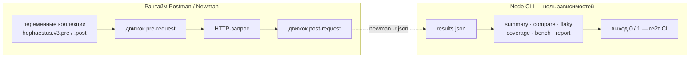
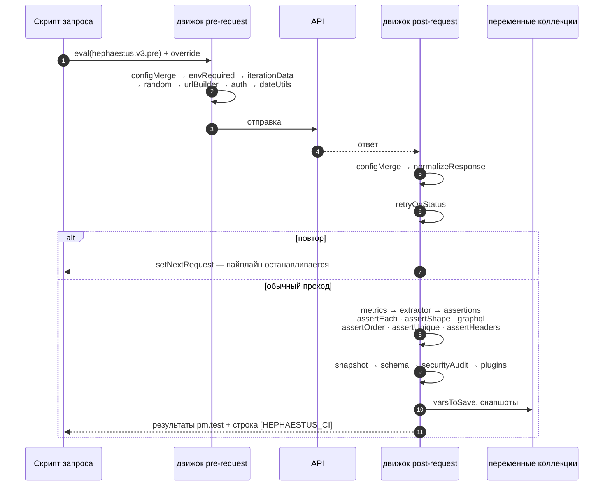
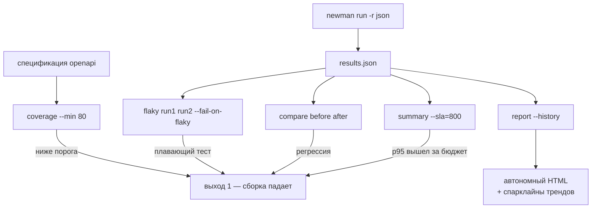

<p align="center">
  
</p>

<p align="center">
  <a href="https://www.npmjs.com/package/hephaestus-postman-framework"></a>
  
  
  
  
  
</p>

<p align="center">
  <a href="README.md">English</a> · <b>Русский</b>
</p>

<p align="center"><i>Разрозненные скрипты, выкованные в единый движок.</i></p>

---

Hephaestus — это модульный фреймворк API-тестирования для Postman и Newman.
Вместо кучи скопированных pre/post-request скриптов каждый запрос несёт
небольшой конфиг `override` и делегирует всю логику одному движку под контролем
версий: слияние конфигов, авторизация, проверки, регрессия по снапшотам,
валидация по схеме, аудит безопасности и структурированное логирование — всё
в фиксированном конвейере.

Тот же автор и тот же фирменный стиль, что и у [Keel](https://github.com/bogdanov-igor/keel)
и [Loft](https://github.com/bogdanov-igor/loft), моих ядер для Claude Code.
Это другая предметная область — общая только дисциплина: измеряй то, что
выпускаешь, будь честен в том, чего оно не делает, и не тащи за собой ни одного
сервиса, который тебе не нужен.

## Новое — вывод на английском и русском

Каждая обращённая к пользователю строка, которую выдаёт движок — имена тестов,
строки логов, сообщения проверок, метки статусов, аудит безопасности — теперь
проходит через каталог локализации
([`engine/src/shared/i18n.js`](engine/src/shared/i18n.js)). Язык выбирается в
конфиге:

```json
{ "locale": "en" }
```

По умолчанию `"ru"`, и он **побайтово идентичен** каждому предыдущему релизу,
так что существующие коллекции и их золотые эталоны не сдвигаются. `"en"` даёт
тот же движок на английском. Golden-харнесс фиксирует оба.

## Быстрый старт

**Сначала посмотреть, как это работает — 60 секунд, без аккаунта и без сети:**

```bash
npx hephaestus init --demo
hephaestus mock hephaestus-demo/demo-collection.json -p 4010   # терминал 1
newman run hephaestus-demo/demo-collection.json \
  -e hephaestus-demo/demo-environment.json                     # терминал 2
```

Пять запросов, 35 проверок, всё зелёное — ответы отдаются из снапшотов, лежащих
в самой коллекции. Каждый запрос показывает одну возможность (`expectedStatus`,
`assertShape` + `assertEach` + `assertOrder`, `assertions` + `varsToSave`,
`snapshot` и 404, который *должен* быть 404). Откройте любой в Postman: весь
тест — это блок `override` наверху вкладки Tests.

Дальше — настройка под свой API.

В одном репозитории поставляются две среды выполнения: **движок**, работающий
внутри Postman, и **Node CLI без зависимостей** для Newman и CI. Начните с
движка.

**1.** Импортируйте поставляемую коллекцию — движок встроен на этапе сборки,
поэтому свежий импорт работает офлайн, без шага загрузки:

```text
Postman → Import → collection/hephaestus-template.postman_collection.json
```

**2.** Откройте **⚙️ defaults** в папке `Hephaestus System`, отредактируйте
JSON-тело и нажмите Send:

```json
{
  "baseUrl": "https://your-api.example.com",
  "locale": "en",
  "auth": { "enabled": false, "type": "none" },
  "contentType": "json",
  "snapshot": { "enabled": false, "autoSaveMissing": true, "mode": "non-strict" },
  "secrets": ["token", "password", "pass", "secret", "key", "authorization", "session"],
  "ci": false
}
```

**3.** Задайте любому запросу `override` и передайте управление движку.
Pre-request:

```javascript
const override = {
  auth: { enabled: true, type: "bearer", token: "{{prod.token}}" }
};
eval(pm.collectionVariables.get("hephaestus.v3.pre"));
```

Тесты (post-request):

```javascript
const override = {
  contentType: "json",
  keysToFind: [
    { path: "data.id",     name: "ID" },
    { path: "data.status", name: "Status", expect: "active" }
  ],
  varsToSave: { token: { path: "data.token", name: "prod.token", scope: "collection" } },
  snapshot: { enabled: true, autoSaveMissing: true }
};
eval(pm.collectionVariables.get("hephaestus.v3.post"));
```

**4.** Для CI запустите Newman и прогоните результаты через CLI (из клона этого
репозитория):

```sh
newman run collection.json -e env.json --reporter-json-export results.json -r json
node bin/hephaestus.js summary results.json --sla=500   # p95-гейт, exit 1 при превышении
```

### Обновление движка

Встроенный движок уже работает. Чтобы подтянуть более свежую сборку из Git на
месте, отправьте запрос `engine-update` в папке `Hephaestus System`. Он
загружает `engine/pre-request.js` и `engine/post-request.js`, сверяет оба с
[`engine/checksums.json`](engine/checksums.json) (SHA-256, внутри песочницы)
перед установкой и сохраняет их в `hephaestus.v3.pre` / `hephaestus.v3.post`.

## Что внутри

- **Движок.** ES-модули в `engine/src/**`, собранные esbuild в два файла
  (~207 КБ суммарно) и выполняемые через eval внутри песочницы Postman —
  движок-как-данные, без установки плагинов, без внешней среды выполнения. Один
  pre-request конвейер и один post-request конвейер прогоняют цепочку модулей
  через общий `ctx`.
- **Коллекция без загрузок.** Поставляемая коллекция встраивает текущий движок
  на этапе сборки. Свежий импорт работает офлайн; `engine-update` нужен только
  чтобы позже подтянуть более новый код.
- **Регрессия по снапшотам.** Эталоны живут в `hephaestus.snapshots` с ключом
  `collection::request::status::format`. `strict` сравнивает всё тело,
  `non-strict` проверяет только `checkPaths`, а `structural` сравнивает *форму*
  (путь → тип) — волатильные значения и длина массива не считаются дрейфом. `snapshotRecord` принудительно
  перезаписывает устаревший эталон за один прогон, когда API изменился по делу.
- **Валидация по схеме.** JSON Schema через встроенный `tv4` — без зависимостей.
- **Аудит безопасности.** Опциональные пассивные проверки ответа: отсутствие
  защитных заголовков, раскрытие версии сервера, утечки stack-trace / debug в
  теле, небезопасный CORS. Каждая выдаёт собственный тест, так что нарушение
  политики валит прогон.
- **Перцентили SLA.** Сводка CLI сообщает времена ответа p50/p90/p95/p99 и
  контролирует прогон по `--sla=<ms>`.
- **Импорт OpenAPI / Swagger.** Превращает спецификацию OpenAPI 3.x или
  Swagger 2.0 (JSON или распространённое подмножество YAML) в готовую коллекцию
  — с заранее заполненными `expectedStatus` и `schema` на каждую операцию —
  без зависимостей.
- **Снапшоты → Postman Examples.** Синхронизирует сохранённые снапшоты в
  нативные Example Responses, пригодные для Mock Server.
- **Маскирование секретов.** Ключи, названные в `secrets`, и совпадающие
  query-параметры URL маскируются только в выводе логов — сохранённые значения
  никогда не меняются.

## Архитектура

Два рантайма, один движок. Движок живёт *внутри* Postman как данные коллекции;
CLI живёт снаружи и движок не трогает — он читает то, что записал Newman.


```mermaid
flowchart LR
    subgraph PM["Рантайм Postman / Newman"]
        direction TB
        V["переменные коллекции<br/>hephaestus.v3.pre / .post"]
        V --> PRE["движок pre-request"]
        PRE --> HTTP["HTTP-запрос"]
        HTTP --> POST["движок post-request"]
    end
    subgraph NODE["Node CLI — ноль зависимостей"]
        direction TB
        RES["results.json"] --> G["summary · compare · flaky<br/>coverage · bench · report"]
        G --> EXIT["выход 0 / 1 — гейт CI"]
    end
    POST -.->|"newman -r json"| RES
```

**Жизненный цикл запроса.** Каждый запрос проходит один и тот же фиксированный
пайплайн. Повтор его обрывает: если `retryOnStatus` решает повторить, всё, что
идёт после него, на этом проходе не выполняется.


```mermaid
sequenceDiagram
    autonumber
    participant Req as Скрипт запроса
    participant Pre as движок pre-request
    participant API
    participant Post as движок post-request
    participant Store as переменные коллекции

    Req->>Pre: eval(hephaestus.v3.pre) + override
    Pre->>Pre: configMerge → envRequired → iterationData<br/>→ random → urlBuilder → auth → dateUtils
    Pre->>API: отправка
    API-->>Post: ответ
    Post->>Post: configMerge → normalizeResponse
    Post->>Post: retryOnStatus
    alt повтор
        Post-->>Req: setNextRequest — пайплайн останавливается
    else обычный проход
        Post->>Post: metrics → extractor → assertions<br/>assertEach · assertShape · graphql<br/>assertOrder · assertUnique · assertHeaders
        Post->>Post: snapshot → schema → securityAudit → plugins
        Post->>Store: varsToSave, снапшоты
        Post-->>Req: результаты pm.test + строка [HEPHAESTUS_CI]
    end
```

**В CI** каждая команда — гейт: она выходит с ненулевым кодом, когда нарушен
её собственный порог, поэтому пайплайн падает именно на том, что регрессировало.


```mermaid
flowchart TD
    N["newman run -r json"] --> R["results.json"]
    R --> S["summary --sla=800"]
    R --> C["compare before after"]
    R --> F["flaky run1 run2 --fail-on-flaky"]
    R --> RP["report --history"]
    SP["спецификация openapi"] --> CV["coverage --min 80"]
    S -->|"p95 вышел за бюджет"| X["выход 1 — сборка падает"]
    C -->|"регрессия"| X
    F -->|"плавающий тест"| X
    CV -->|"ниже порога"| X
    RP --> H["автономный HTML<br/>+ спарклайны трендов"]
```

## Что остаётся за рамками

- **Собственного тест-раннера нет.** Hephaestus — это логика; выполняют её
  Postman и Newman. Нет ни демона, ни хостящегося сервиса, ни дашборда, ни базы
  данных.
- **Состояние живёт в коллекции.** Снапшоты, токены OAuth2 и плагины — это
  переменные коллекции. Это делает всё портируемым и diff-абельным, но это не
  хранилище данных — большие наборы снапшотов место в настоящем регрессионном
  конвейере.
- **Проверка целостности — это защита от подмены, а не подтверждение
  авторства.** `engine-update` доказывает, что загруженный код соответствует
  `checksums.json` при передаче. Он не доказывает, кто написал эту контрольную
  сумму — подписи нет. Доверяйте источнику, из которого тянете. То же самое
  сказано в [SECURITY.md](SECURITY.md).
- **Схема — это JSON Schema draft 4** (встроенный `tv4`), а не новейшие
  черновики — цена нулевых runtime-зависимостей.
- **Импорт OpenAPI разбирает JSON и распространённое подмножество YAML**, а не
  полную спецификацию YAML. Экзотические спецификации могут потребовать сначала
  конвертации в JSON.

## Конфигурация

Всё — это один слитый конфиг: `hephaestus.defaults` (на всю коллекцию),
глубоко слитый с `override` на каждый запрос. Основные поля:

| Поле | По умолчанию | Назначение |
|---|---|---|
| `baseUrl` | `""` | База API; протокол подставляется из `defaultProtocol`, если опущен |
| `locale` | `"ru"` | Язык вывода движка — `"ru"` или `"en"` |
| `auth` | `none` | `none` · `basic` · `bearer` · `headers` · `variables` · `oauth2cc` |
| `contentType` | `"json"` | Разбор ответа: `json` · `xml` · `text` |
| `expectedStatus` | `[200,201,202]` | Ожидаемый HTTP-статус — число или список; управляет негативным тестированием |
| `maxResponseTime` | `1000` | Провал, если ответ медленнее (мс) |
| `maxBytes` | выкл | Провал, если тело ответа больше N байт |
| `snapshot` | выключено | `mode`, `checkPaths`, `ignorePaths`, `autoSaveMissing`, `record` |
| `schema` | выключено | Определение JSON Schema, валидируемое через `tv4` |
| `securityAudit` | выключено | Пассивные проверки: заголовки · раскрытие · CORS · cookie-флаги · JWT · no-store |
| `secrets` | `[…]` | Имена ключей, маскируемые в логах |
| `ci` | `false` | Выдавать структурированную JSON-строку `[HEPHAESTUS_CI]` на запрос |
| `strictMode` | `false` | Валить прогон на неизвестном ключе `override` (защита от опечаток); выключено — только предупреждение |
| `extraKeys` | `[]` | Имена ключей, считающихся известными при `strictMode` — так сторонний плагин объявляет свой конфиг |
| `graphql` | выключено | Проверки контракта GraphQL — `noErrors`, `errorCount`, `errorContains`, `dataShape` |
| `retryOnStatus` | выключено | Повтор на заданных статусах; `respectRetryAfter` учитывает серверный `Retry-After` (с потолком) |

Полный справочник по каждому полю — в
[`docs/config-reference.html`](docs/config-reference.html).

## Модули

Движок — это фиксированный набор модулей, прогоняемых через общий `ctx`; это
перечень, а не точный порядок вызова:

**Pre-request** — `configMerge` · `envRequired` · `iterationData` · `random` ·
`urlBuilder` · `auth` · `dateUtils` · `logger`.

**Post-request** — `configMerge` · `normalizeResponse` · `metrics` ·
`extractor` · `assertions` · `assertEach` · `assertShape` · `graphql` ·
`assertOrder` · `assertUnique` · `assertHeaders` · `retryOnStatus` · `snapshot` · `schema` ·
`securityAudit` · `plugins` · `logger`.

`assertions` покрывает `keysToFind` / `varsToSave` / `keysToCount` / `assertMap` /
`maxResponseTime`; `extractor` открывает `ctx.api` с `get / find / all /
count / save` над JSON и XML, dot-пути и wildcard-ы `[*]`. Кастомные `plugins`
расширяют движок из переменных коллекции без форка. Детали по каждому модулю и
примеры — в [`docs/features.html`](docs/features.html).

## CLI

Node-инструментарий без зависимостей, один бинарник, пробрасывает коды выхода,
так что каждая команда работает как CI-гейт. Из клона этого репозитория:

```sh
node bin/hephaestus.js <command> [args]
# те же инструменты подключены как npm-скрипты:
npm run <command> -- [args]
```

Или вообще без клонирования — пакет опубликован в npm:

```sh
npm i -g hephaestus-postman-framework
hephaestus <command> [args]
# или разово:
npx hephaestus-postman-framework <command> [args]
```

| Команда | Что делает |
|---|---|
| `summary <results.json> [--md] [--sla=<ms>]` | Сводка прогона + p50/p90/p95/p99, SLA-гейт |
| `compare <before> <after> [--md]` | Diff двух прогонов — регресс-гейт, exit 1 при регрессии |
| `report <results.json> [out.html]` | Автономный HTML-отчёт |
| `junit <results.json\|-> [out.xml]` | Newman JSON → JUnit XML |
| `migrate <collection.json>` | Классифицирует состояние миграции коллекции |
| `docs <collection.json>` | API-документация из тест-скриптов коллекции |
| `sync-examples <collection.json>` | Снапшоты → Postman Example Responses |
| `openapi <spec>` | OpenAPI / Swagger → коллекция Hephaestus (`--negative` добавляет тесты ошибок) |
| `init` | Интерактивный мастер конфига / окружения |
| `generate` | Интерактивный мастер → готовый к вставке блок `override` |
| `panel [-c <collection.json>]` | Локальная панель: история прогонов, снапшоты, редактор defaults |
| `watch -c <collection.json>` | Перезапуск Newman при изменении файла |
| `flaky <run1> <run2> … [--fail-on-flaky]` | Ищет проверки, «плавающие» между прогонами — выход 1 при находке |
| `coverage --spec <spec> <collection> [--min N]` | Покрытие OpenAPI коллекцией — выход 1 ниже порога |
| `trends [history.jsonl] [--last N]` | Спарклайны pass-rate / p95 по сохранённым прогонам |
| `mock <collection.json> [-p <port>]` | Отдаёт сохранённые снапшоты как локальный API — разработка офлайн |
| `doctor [-e <env.json>]` | Предполётная проверка: целостность движка, версии, дрейф |
| `bench [--runs K] [--max-ms M]` | Накладные расходы движка на запрос (A/B против no-op) — гейт регрессии |

`node bin/hephaestus.js --help` перечисляет всё.

## Тесты и целостность

- **Golden-харнесс движка** — настоящий движок запускается под Newman против
  mock-сервера, и его вывод сравнивается побайтово с золотым эталоном:
  **464 проверки в 48 запросах**, обе локали зафиксированы. Он ловит любой
  дрейф в поведении движка, а не только в инструментарии.
- **`npm test`** — **143 теста** по CLI-скриптам (docs, summary, compare,
  JUnit, migrate, импорт OpenAPI, sync-examples) и проверка маскирования секретов.
- **`npm run build`** — **10 проверок**: бандл движка синхронен с `engine/src`,
  версия из единого источника, `checksums.json` и встроенная коллекция
  актуальны, defaults и коллекция — валидный JSON.
- **eslint** чист по `engine/`, `setup/`, `templates/`.

Нулевые runtime-зависимости. Только для разработки: `esbuild` (запинён),
`newman`, `eslint`.

## Документация

| Документ | Что внутри |
|---|---|
| [быстрый старт](docs/quickstart.html) | Import → defaults → первый запрос, от и до |
| [справочник конфига](docs/config-reference.html) | Каждое поле конфига, типизировано, с дефолтами |
| [рецепты](docs/recipes.md) | 10 частых задач → 10 готовых `override`-блоков |
| [возможности](docs/features.html) | Модуль за модулем с примерами |
| [newman и CI](docs/newman-ci.md) | Настройки GitHub Actions, GitLab CI, Jenkins |
| [CI-шаблоны](docs/ci/) | Готовые пайплайны: GitHub Actions, GitLab CI, Jenkins |
| [просмотр снапшотов](docs/snapshot-viewer.html) | Визуальный браузер для `hephaestus.snapshots` |
| [галерея плагинов](gallery/plugins/) | Четыре готовых плагина + шаблон для своего |
| [главная документации](docs/index.html) | Локальный индекс сайта документации |

Полное руководство двуязычно: этот файл (Русский) и
[README.md](README.md) (English).

## Лицензия

[MIT](LICENSE) © 2026 **Igor Bogdanov** · <bogdanov.ig.alex@gmail.com>

Свободно использовать, форкать и строить поверх, в том числе коммерчески.
Сохраняйте атрибуцию.
